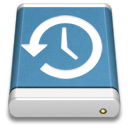
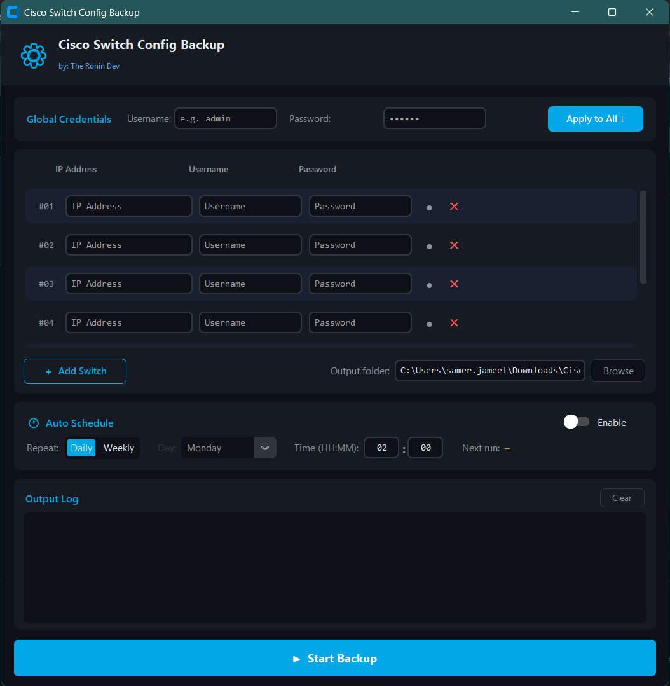
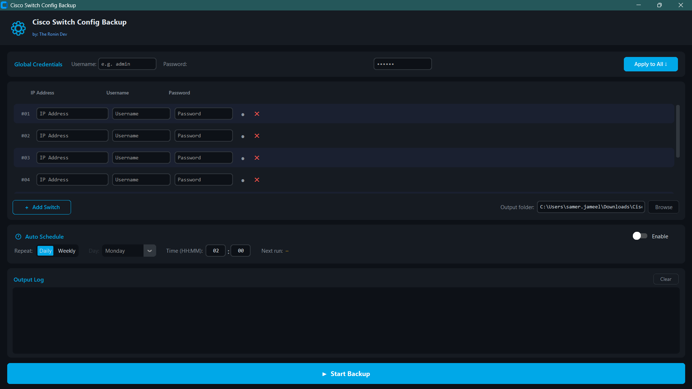

# 🔄 Cisco Switch Config Backup

<p align="center">
  
</p>

<p align="center">
  A modern, GUI-based tool for automatically backing up Cisco switch running configurations over Telnet — with scheduling, system tray support, and change detection.
</p>

<p align="center">
  
  
  
  
</p>

---

## ✨ Features

- **Multi-switch support** — manage and back up as many switches as you need in one run
- **Per-switch credentials** — set individual username/password per device, or use "Apply to All" for global credentials
- **Config change detection** — skips unchanged configs; shows `+added / -removed` line counts when a config has changed
- **Auto-schedule** — run backups automatically on a daily or weekly schedule at a time you choose
- **System tray integration** — closes to tray instead of exiting; right-click the tray icon to show the window, run a backup, or quit
- **Windows toast notifications** — get notified of backup results and config changes without having the window open
- **Persistent settings** — all switches, credentials, output folder, and schedule settings are saved to a local JSON file between sessions
- **Output log** — timestamped in-app log for every backup session with color-coded status messages
- **Standalone EXE** — build a single portable `.exe` with no Python installation required (via PyInstaller)

---

## 📸 Screenshot




---

## 🚀 Getting Started

### Prerequisites

- Python **3.10+**
- Windows OS (system tray and toast notifications are Windows-specific)
- Cisco IOS switches accessible via **Telnet** on your network

### Installation

1. **Clone the repository**

   ```bash
   git clone https://github.com/theronindev/Simple-Cisco-Switch-Backup.git
   cd cisco-backup-software
   ```

2. **Install dependencies**

   ```bash
   pip install customtkinter netmiko pystray pillow schedule plyer
   ```

3. **Run the application**

   ```bash
   python cisco_backup_gui.py
   ```

---

## 🛠️ Building a Standalone EXE

A `build.bat` script is included to automate the full build process using **PyInstaller**.

```bash
build.bat
```

This will:
1. Install/upgrade all required dependencies
2. Clean any previous build artifacts
3. Compile the application into a single `dist\CiscoBackup.exe`

The resulting EXE requires no Python installation and can be distributed as-is.

> **Note:** UPX compression is disabled by default in `CiscoBackup.spec`. Enable it by setting `upx=True` if UPX is installed on your system.

---

## 🖥️ Usage

1. **Add your switches** — Enter an IP address, username, and password for each switch. Use the **"Apply to All ↓"** button to push global credentials to every row at once.
2. **Set an output folder** — Configs are saved as `<hostname>.txt` (the hostname is parsed directly from the running config).
3. **Run a backup** — Click **▶ Start Backup**. Each row shows a color-coded status dot (idle / running / success / error).
4. **Schedule automatic backups** — Enable the Auto Schedule panel, choose Daily or Weekly, set a time, and the app will run backups in the background.
5. **Minimize to tray** — Closing the window hides it to the system tray. Right-click the tray icon to restore or exit.

---

## 📁 Project Structure

```
cisco-backup-software/
├── cisco_backup_gui.py      # Main application (GUI + backup logic)
├── CiscoBackup.spec         # PyInstaller build spec
├── build.bat                # One-click EXE builder script
├── IconMaker.py             # Utility to generate the app icon
├── myicon.png               # Application icon
└── README.md
```

**Generated at runtime (not committed):**
```
├── cisco_backup_settings.json   # Persisted user settings
├── cisco_backup.log             # Backup activity log
└── switch_configs/              # Default output folder for .txt config files
```

---

## ⚙️ Tech Stack

| Library | Purpose |
|---|---|
| [CustomTkinter](https://github.com/TomSchimansky/CustomTkinter) | Modern dark-themed GUI framework |
| [Netmiko](https://github.com/ktbyers/netmiko) | SSH/Telnet network device automation |
| [pystray](https://github.com/moses-palmer/pystray) | System tray icon and menu |
| [schedule](https://github.com/dbader/schedule) | In-process job scheduling |
| [plyer](https://github.com/kivy/plyer) | Cross-platform desktop notifications |
| [Pillow](https://python-pillow.org/) | Image handling for the tray icon |
| [PyInstaller](https://pyinstaller.org/) | Packaging into a standalone EXE |

---

## 🔒 Security Notes

- Credentials are stored in `cisco_backup_settings.json` in **plain text** on the local machine. Ensure this file is protected appropriately (e.g., restricted file permissions, not committed to version control).
- This tool connects to switches over **Telnet**, which transmits data unencrypted. Use on a trusted management network or consider migrating to SSH (`cisco_ios` device type in Netmiko).

---

## 🤝 Contributing

Contributions, issues, and feature requests are welcome! Feel free to open a pull request or file an issue.

1. Fork the project
2. Create your feature branch (`git checkout -b feature/my-feature`)
3. Commit your changes (`git commit -m 'Add my feature'`)
4. Push to the branch (`git push origin feature/my-feature`)
5. Open a Pull Request

---

## 👤 Author

**The Ronin Dev**
🌐 [theronindev.dev](https://www.theronindev.dev)

---

## 📄 License

This project is licensed under the **MIT License** — see the [LICENSE](LICENSE) file for details.
